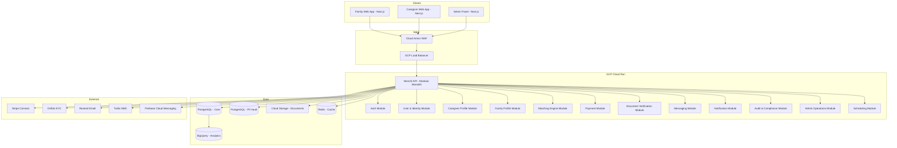
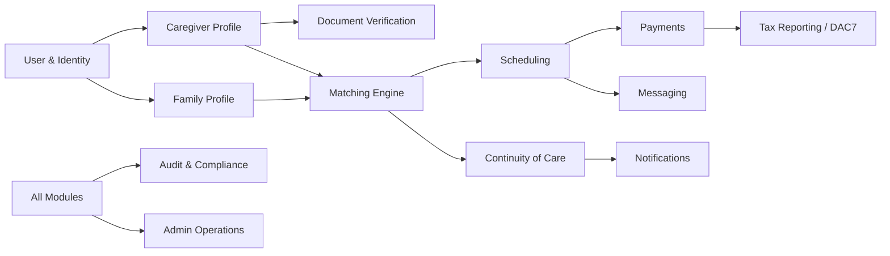

# IT Architecture Document — Caregiver Matching Platform

**Poland → EU Expansion | Complete Technical Blueprint**

Version 1.0 — March 2026
Classification: Confidential

---

## Table of Contents

1. [Executive Architecture Overview](#1-executive-architecture-overview)
2. [Architecture Style Decision](#2-architecture-style-decision)
3. [High-Level System Architecture](#3-high-level-system-architecture)
4. [System Architecture Diagram](#4-system-architecture-diagram)
5. [Domain Architecture](#5-domain-architecture)
6. [Data Architecture](#6-data-architecture)
7. [Security Architecture](#7-security-architecture)
8. [Infrastructure Architecture](#8-infrastructure-architecture)
9. [Recommended Technology Stack](#9-recommended-technology-stack)
10. [Repository Structure](#10-repository-structure)
11. [Development Workflow](#11-development-workflow)
12. [Observability and Operations](#12-observability-and-operations)
13. [Cost-Optimized MVP](#13-cost-optimized-mvp)
14. [Scaling Roadmap](#14-scaling-roadmap)
15. [Technical Implementation Roadmap](#15-technical-implementation-roadmap)
16. [Architecture Decision Records (ADR)](#16-architecture-decision-records-adr)
17. [Security Checklist for Launch Readiness](#17-security-checklist-for-launch-readiness)

---

## 1. Executive Architecture Overview

This document defines the production-ready technical architecture for a digital marketplace that connects professional caregivers with families requiring elderly care services. The platform operates as a managed marketplace — not a passive listing board — actively managing verification, risk, quality, and continuity of care.

The system is designed around a **modular monolith** deployed on **Google Cloud Platform (GCP)**, chosen for its strong EU data residency options, competitive pricing for startups, and mature managed services. The architecture enforces privacy-by-design principles with physically separated sensitive data stores, immutable audit logging, and GDPR-compliant data handling from day one.

Key architectural decisions prioritize operational simplicity for a small engineering team (3–5 developers) while maintaining a clear path to service extraction as the platform scales from Polish metropolitan areas to EU-wide operations across the PL→DE/AT corridor.

### Core Architecture Properties

| Property | Implementation | Rationale |
|----------|---------------|-----------|
| Security First | Centralized identity (Supabase Auth), encrypted PII vault, WAF, RBAC/ABAC | Healthcare-adjacent data requires defense-in-depth |
| Privacy by Design | Separated PII store, time-limited access tokens, automatic data retention policies | GDPR Art. 25 compliance from launch |
| Cost Efficiency | GCP Cloud Run (pay-per-use), managed Postgres, serverless queues | Target <€500/month for MVP infrastructure |
| Operational Simplicity | Modular monolith, single deployment unit, managed services | Small team cannot operate microservices |
| Scalability | Stateless compute, connection pooling, async job processing | Horizontal scaling without re-architecture |
| Compliance Readiness | DAC7 pipeline, audit logs, RODO Art. 9 encryption, PD A1 automation | EU regulatory requirements from first transaction |

---

## 2. Architecture Style Decision

### Evaluation of Approaches

Three architecture styles were evaluated against the constraints of a small engineering team, healthcare-adjacent data sensitivity, and phased EU expansion:

| Approach | Pros | Cons | Verdict |
|----------|------|------|---------|
| Pure Microservices | Independent scaling, tech diversity, fault isolation | High ops overhead, distributed transactions, complex CI/CD, requires platform team | **REJECTED** — premature for team size and stage |
| Simple Monolith | Fast development, single deployment, easy debugging | Domain coupling risk, difficult to extract later, single scaling unit | **REJECTED** — insufficient isolation for sensitive data domains |
| Modular Monolith | Domain isolation, single deployment, clear extraction path, low ops | Requires discipline in module boundaries, shared database | **SELECTED** — optimal balance |

### Selected: Modular Monolith with Isolated Data Stores

The architecture uses a modular monolith as the primary compute unit, deployed as a single NestJS application on GCP Cloud Run. Critical distinction: while the application is a single deployable, it enforces strict module boundaries at the code level with separate database schemas for sensitive data domains.

**Module isolation rules:**

- Each domain module exposes only a typed public API (no direct DB access across modules)
- Sensitive data (PII, documents, health data) resides in logically separated PostgreSQL schemas with distinct access credentials
- Inter-module communication uses in-process event bus (replaceable with message queue for future extraction)
- Payment and document verification modules interact with external services through adapter interfaces

**Extraction triggers (when to split a module into a service):**

- Independent scaling requirement (e.g., matching engine under heavy load)
- Different deployment cadence needed
- Regulatory requirement for physical data isolation
- Team grows beyond 8 engineers

---

## 3. High-Level System Architecture

The platform comprises the following major components, each designed to minimize operational overhead while maintaining strong security boundaries:

| Component | Technology | Deployment | Purpose |
|-----------|-----------|------------|---------|
| Web Platform | Next.js 15 (App Router) | Vercel / GCP Cloud Run | Family-facing search + caregiver portal, SSR for SEO |
| Backend API | NestJS 11 (Node.js 22) | GCP Cloud Run | Core business logic, REST + limited GraphQL |
| Authentication | Supabase Auth | Managed SaaS | JWT-based auth, MFA, social login, phone verification |
| Primary Database | PostgreSQL 16 (Cloud SQL) | GCP Cloud SQL | Core transactional data, JSONB for flexible care needs |
| PII Vault | PostgreSQL 16 (separate instance) | GCP Cloud SQL | Encrypted sensitive personal data, restricted access |
| Document Storage | GCP Cloud Storage (encrypted) | GCP managed | Identity docs, certifications, signed URL access |
| Document Verification | Onfido API | External SaaS | KYC/identity verification, document authenticity |
| Matching Engine | NestJS module + PostgreSQL | In-process (extractable) | Caregiver-family matching with scoring algorithm |
| Payments | Stripe Connect (EU) | External SaaS | Split payments, escrow, IBAN collection, DAC7 data |
| Notifications | GCP Pub/Sub + Firebase FCM | Managed | Push, email (Resend), SMS (Twilio) |
| Admin Panel | Next.js (shared app, admin routes) | Same deployment | Coordinator tools, verification queue, analytics |
| Observability | GCP Cloud Logging + Grafana Cloud | Managed | Structured logs, metrics, tracing, alerting |
| Queue / Async Jobs | GCP Cloud Tasks + Pub/Sub | Managed | Background jobs, event processing, retries |
| Analytics | Metabase + BigQuery | Managed | Business intelligence, outcome measurement, grant reporting |
| Cache | Redis (Memorystore) | GCP managed | Session data, rate limiting, matching cache |
| Search | PostgreSQL full-text (pg_trgm) | In-database | Caregiver discovery, filtering (upgrade to Typesense later) |

---

## 4. System Architecture Diagram

### High-Level System Topology



### Domain Module Interaction



---

## 5. Domain Architecture

Each domain module is a self-contained unit with explicit boundaries, its own database schema, and a typed public API. Modules communicate through an in-process event bus using typed events.

| Domain Module | Responsibilities | Key Entities | External Dependencies |
|--------------|-----------------|-------------|----------------------|
| User & Identity | Account creation, authentication, role assignment, profile basics, phone verification, MFA management | User, Role, Session, PhoneVerification | Supabase Auth |
| Caregiver Profile | Professional profile, skills, certifications, availability calendar, language progression tracking, credential wallet | CaregiverProfile, Skill, Certification, Availability, LanguageLevel | None (internal) |
| Family Profile | Care needs (JSONB), senior health context, location, budget ranges, preferences | FamilyProfile, CareNeeds, SeniorProfile, BudgetConfig | None (internal) |
| Matching Engine | Discovery, filtering, scoring, ranking, recommendation signals, standby pool management | MatchRequest, MatchResult, MatchScore, StandbyPool | None (extractable) |
| Scheduling | Booking lifecycle, calendar management, shift management, replacement coordination | Booking, Shift, Schedule, ReplacementRequest | None (internal) |
| Document Verification | Upload pipeline, malware scanning, encrypted storage, verification queue, status tracking, retention policies | Document, VerificationRequest, VerificationResult | Onfido, GCP Cloud Storage |
| Payments | Family billing, escrow management, caregiver payouts, platform fees, refunds, IBAN collection | Transaction, Payout, Escrow, PlatformFee, Refund | Stripe Connect |
| Tax Reporting (DAC7) | Total Consideration tracking, XML/JSON export to KAS, IBAN/NIP/PESEL collection, tax residency management | TaxRecord, DAC7Report, SellerData | KAS (Polish tax authority) |
| Continuity of Care | Breakdown risk prediction, standby pool activation, SLA monitoring, care continuity planning, escalation workflows | ContinuityPlan, RiskFlag, EscalationEvent | None (internal) |
| Messaging | Secure in-app messaging between matched parties, message encryption, moderation hooks | Conversation, Message, MessageAttachment | None (internal) |
| Notifications | Multi-channel delivery (push, email, SMS), template management, delivery tracking, preference management | Notification, Template, DeliveryLog, UserPreference | Resend, Twilio, FCM |
| Admin Operations | Coordinator panel, verification queue management, user management, dispute resolution, platform configuration | AdminAction, DisputeCase, PlatformConfig | None (internal) |
| Audit & Compliance | Immutable event logging, GDPR data requests, data retention enforcement, compliance reporting | AuditEvent, DataRequest, RetentionPolicy | BigQuery (for long-term storage) |

### Module Communication Pattern

Modules communicate exclusively through two mechanisms:

- **Synchronous:** Typed service interfaces (for queries requiring immediate response)
- **Asynchronous:** Domain events via in-process EventEmitter (for notifications, audit logging, analytics)

**Example domain events:**

- `CaregiverVerified` → triggers matching pool update, notification to caregiver
- `BookingCreated` → triggers payment initiation, scheduling update, audit log
- `RiskFlagRaised` → triggers continuity planning, coordinator notification
- `PaymentCompleted` → triggers payout scheduling, DAC7 record update, receipt notification

---

## 6. Data Architecture

### 6.1 Core Entities and Relationships

The data model is split across two PostgreSQL instances for security isolation. The core database handles transactional data; the PII vault stores sensitive personal information with separate access credentials.

#### Core Database Schema

| Entity | Key Fields | Relationships |
|--------|-----------|---------------|
| users | id (UUID), email, role (enum), status, created_at, last_login | 1:1 caregiver_profiles, 1:1 family_profiles |
| caregiver_profiles | user_id (FK), skills (JSONB), availability (JSONB), location (PostGIS), hourly_rate, retention_score, verification_status | N:M certifications, 1:N bookings |
| family_profiles | user_id (FK), care_needs (JSONB), location (PostGIS), budget_range, care_type (enum) | 1:N care_recipients, 1:N bookings |
| care_recipients | id, family_id (FK), health_context (JSONB — encrypted), mobility_level, dementia_stage | N:1 family_profiles |
| bookings | id, caregiver_id, family_id, status (enum), shift_start, shift_end, rate_agreed | 1:1 transactions, 1:N shifts |
| transactions | id, booking_id (FK), amount, currency, stripe_id, status, platform_fee | 1:1 payouts, 1:1 escrow_records |
| match_results | id, family_id, caregiver_id, score, factors (JSONB), created_at | N:1 families, N:1 caregivers |
| documents | id, user_id, type (enum), storage_path (encrypted), verification_status, expires_at | N:1 users |
| audit_events | id, actor_id, action, resource_type, resource_id, metadata (JSONB), timestamp | Append-only, immutable |
| conversations | id, booking_id, participants (array), created_at | 1:N messages |
| notifications | id, user_id, channel, template_id, status, sent_at | N:1 users |

#### PII Vault Schema (Separate Instance)

| Entity | Fields | Access Control |
|--------|--------|---------------|
| pii_records | user_id (FK), first_name (encrypted), last_name (encrypted), date_of_birth (encrypted), nationality | API-only, no direct DB access from application modules |
| identity_documents | user_id, document_type, document_number (encrypted), issuing_country, expiry_date | Read: verification module only; Write: upload pipeline only |
| tax_identifiers | user_id, nip (encrypted), pesel (encrypted), iban (encrypted), tax_residency | Read: payment + DAC7 modules only |
| address_records | user_id, street (encrypted), city, postal_code, country | Read: matching (city-level only) + admin |

### 6.2 Sensitive Data Handling

- All PII fields use **AES-256-GCM encryption** at the application layer (not just at-rest database encryption)
- Encryption keys managed via **GCP Secret Manager** with automatic rotation every 90 days
- Health-related JSONB fields (Art. 9 RODO) encrypted with **separate key hierarchy**
- **Time-limited access:** caregiver sees senior health context only during active booking, revoked automatically on booking end
- **Tokenization:** internal references use opaque UUIDs; real identifiers resolved only at the PII vault boundary

### 6.3 Audit Logging Model

- Append-only `audit_events` table with **no UPDATE/DELETE permissions** granted to any application role
- Every write operation on sensitive entities generates an audit event with actor, action, resource, and timestamp
- Audit logs replicated to **BigQuery daily** for long-term retention (7 years for financial records per DAC7)
- Tamper detection: **SHA-256 hash chain** linking consecutive audit events

### 6.4 Document Storage Model

- Documents stored in **GCP Cloud Storage** with server-side encryption (CMEK via Cloud KMS)
- Access exclusively via **signed URLs with 15-minute expiry** and single-use tokens
- Malware scanning via **ClamAV in Cloud Run job** before storage
- Retention policies: identity documents retained for duration of account + 2 years; financial documents for 7 years; automatic deletion thereafter

### 6.5 Analytics Separation

Operational and analytical workloads are strictly separated:

- Core PostgreSQL serves only transactional queries (OLTP)
- Nightly ETL pipeline (Cloud Functions) exports anonymized/aggregated data to BigQuery
- Metabase connects only to BigQuery for dashboards and reporting
- No direct analyst access to production database
- **PII never enters the analytics pipeline** — only pseudonymized identifiers and aggregated metrics

---

## 7. Security Architecture

### 7.1 Authentication

- **Supabase Auth** as centralized identity provider — no custom auth implementation
- JWT tokens with short expiry (15 min access, 7 day refresh)
- Mandatory phone verification for all accounts (SMS OTP via Twilio)
- Optional MFA via TOTP (recommended for caregivers with verified status)
- Social login: Google, Apple (optional convenience; phone verification still required)
- Session management: single active session by default; concurrent session requires explicit approval

### 7.2 Authorization (RBAC + ABAC Hybrid)

| Role | Base Permissions | Attribute-Based Restrictions |
|------|-----------------|------------------------------|
| family | View caregiver profiles, create bookings, manage own profile, send messages | Can only view caregivers in matched/active state; budget-filtered results |
| caregiver | Manage own profile, respond to bookings, view active client info, upload documents | Health context visible only during active booking; location shared at city level until matched |
| coordinator | View verification queue, manage disputes, view reports, moderate content | Cannot access PII vault directly; actions logged with justification field |
| admin | Full platform configuration, user management, financial overview | JIT access with time-limited elevation; all actions require MFA re-authentication |
| system | Automated processes: matching, notifications, ETL, audit | Service accounts with narrowest possible IAM roles; no interactive login |

### 7.3 PII Segregation

- Separate PostgreSQL instance for PII vault with **distinct Cloud SQL credentials**
- Application accesses PII vault through a dedicated `PiiService` with rate-limited, audited methods
- **No JOINs possible** between core DB and PII vault (enforced by separate instances)
- PII resolution happens at the API response boundary — internal modules work with tokenized references

### 7.4 Document Security

- **Upload pipeline:** client → signed upload URL → Cloud Storage → ClamAV scan → move to verified bucket
- **Storage:** CMEK encryption via Cloud KMS, bucket-level access control, no public access
- **Access:** signed URLs with 15-min expiry, generated on-demand with audit log entry
- **Retention:** automated lifecycle policies delete expired documents; manual deletion blocked

### 7.5 Secrets Management

- All secrets stored in **GCP Secret Manager** (API keys, DB credentials, encryption keys)
- Application reads secrets at startup via IAM-authenticated API calls
- **No secrets in environment variables, code, or configuration files**
- Automatic key rotation: encryption keys every 90 days, API keys every 180 days
- Separate secret namespaces per environment (dev/staging/prod)

### 7.6 API Security

- **GCP Cloud Armor WAF** in front of all public endpoints
- Rate limiting: 100 req/min per authenticated user, 20 req/min for unauthenticated, 5 req/min for auth endpoints
- Input validation: **Zod schemas** on all API endpoints with strict type checking
- CORS: allowlist of known frontend origins only
- CSRF: SameSite cookie policy + CSRF tokens for state-changing operations
- Request size limits: 10MB for document uploads, 1MB for all other endpoints

### 7.7 Bot Protection

- reCAPTCHA v3 on registration and login flows
- Device fingerprinting for fraud signal collection
- Automated blocking of known bot user agents and suspicious patterns
- Honeypot fields on registration forms

### 7.8 Admin Access Security

- **Just-in-time (JIT)** privilege elevation with configurable time window (default: 4 hours)
- All admin actions require re-authentication via MFA
- Admin action log with **mandatory justification field**
- Quarterly access reviews with automatic deprovisioning of unused admin accounts
- Separate admin authentication flow with IP allowlisting for sensitive operations

### 7.9 Threat Model

| Threat | Impact | Likelihood | Mitigation |
|--------|--------|------------|------------|
| Fake caregiver accounts | High — safety risk to families | High | Mandatory KYC (Onfido), phone verification, document verification pipeline, manual review queue |
| Identity theft / impersonation | Critical — regulatory + safety | Medium | Multi-factor verification, liveness detection (Onfido), background check integration |
| Document forgery | High — trust undermined | Medium | Onfido automated document verification, checksum validation, manual review for flagged docs |
| Unauthorized PII access | Critical — GDPR breach | Low | Separate PII vault, application-layer encryption, audit logging, least-privilege IAM |
| Caregiver database scraping | High — competitive risk | Medium | Rate limiting, bot protection, no bulk export APIs, pagination limits |
| Payment fraud | High — financial loss | Medium | Stripe Radar, escrow model, velocity checks, manual review for unusual patterns |
| Insider threat (admin abuse) | High — data breach | Low | JIT access, MFA, audit logging, justification fields, quarterly reviews |
| DDoS attack | Medium — availability | Medium | Cloud Armor DDoS protection, Cloud Run auto-scaling, rate limiting |
| Data leak through logs | High — GDPR breach | Medium | PII scrubbing in log pipeline, structured logging with field classification, no sensitive data in error messages |
| Session hijacking | Medium — account takeover | Low | Short JWT expiry, secure cookie flags, session binding to device fingerprint |

---

## 8. Infrastructure Architecture

### 8.1 Cloud Setup (GCP — europe-central2, Warsaw)

GCP selected over AWS/Azure for: (1) superior startup credits program, (2) Warsaw region for Polish data residency, (3) BigQuery for cost-effective analytics, (4) Cloud Run's generous free tier.

| Layer | Service | Configuration | Est. Monthly Cost (MVP) |
|-------|---------|--------------|------------------------|
| Compute | Cloud Run | 1 service, min 0 / max 4 instances, 1 vCPU, 512MB RAM | €0–€30 |
| Primary Database | Cloud SQL PostgreSQL 16 | db-f1-micro (shared), 10GB SSD, automated backups | €15–€25 |
| PII Vault Database | Cloud SQL PostgreSQL 16 | db-f1-micro (shared), 5GB SSD, private IP only | €15–€25 |
| Cache | Memorystore Redis | Basic tier, 1GB | €30 |
| Object Storage | Cloud Storage | Standard tier, ~10GB initially | €1–€3 |
| Queue / Tasks | Cloud Tasks + Pub/Sub | Pay-per-use | €0–€5 |
| CDN | Cloud CDN (via Load Balancer) | Caching static assets | €5–€10 |
| WAF | Cloud Armor | Standard tier, managed rules | €5/policy + €0.75/M requests |
| Secrets | Secret Manager | Pay-per-access | <€1 |
| KMS | Cloud KMS | Key management for encryption | €1–€3 |
| Monitoring | Cloud Logging + Grafana Cloud (free tier) | Structured logs, metrics | €0–€10 |
| Analytics | BigQuery | Pay-per-query, ~10GB scanned/month initially | €0–€5 |
| CI/CD | GitHub Actions | Free tier for private repos (2000 min/month) | €0 |

**Estimated total MVP infrastructure cost: €80–€150/month**

### 8.2 Environment Separation

| Environment | Purpose | Infrastructure | Data |
|-------------|---------|---------------|------|
| Development | Local development | Docker Compose (PostgreSQL, Redis) | Synthetic test data only |
| Staging | Pre-production testing, QA | Minimal Cloud Run + shared Cloud SQL | Anonymized production subset |
| Production | Live platform | Full Cloud Run + dedicated Cloud SQL instances | Real data, encrypted, audited |

### 8.3 Network Architecture

- VPC with private subnets for database instances (no public IP on Cloud SQL)
- Cloud Run connects to Cloud SQL via VPC connector (Serverless VPC Access)
- Cloud Armor WAF at the load balancer edge
- All internal communication over private network; no public endpoints for databases or cache
- Egress restricted to known external service IPs (Stripe, Onfido, Resend, Twilio)

---

## 9. Recommended Technology Stack

| Layer | Technology | Version | Why This Choice |
|-------|-----------|---------|----------------|
| Frontend | Next.js (App Router) | 15.x | SSR for SEO (family acquisition), React ecosystem, Vercel deployment simplicity |
| UI Components | shadcn/ui + Tailwind CSS | Latest | Accessible components, consistent design system, no runtime overhead |
| Backend | NestJS | 11.x | Modular architecture support, TypeScript-native, decorators for clean domain code |
| Runtime | Node.js | 22 LTS | TypeScript across stack, async I/O for marketplace workloads, team skill alignment |
| Primary Database | PostgreSQL | 16 | JSONB for flexible care needs, PostGIS for geo queries, mature, reliable |
| ORM | Drizzle ORM | Latest | Type-safe queries, lightweight, excellent PostgreSQL support, better than Prisma for complex queries |
| Auth Provider | Supabase Auth | v2 | Self-hostable, OIDC-compliant, built-in MFA, phone auth, generous free tier |
| Object Storage | GCP Cloud Storage | N/A | CMEK encryption, signed URLs, lifecycle policies, tight GCP integration |
| Queue | GCP Cloud Tasks + Pub/Sub | N/A | Managed, pay-per-use, at-least-once delivery, dead letter queues |
| Cache | Redis (Memorystore) | 7.x | Session store, rate limiting, matching result cache |
| Search | PostgreSQL pg_trgm + full-text | Built-in | Sufficient for MVP; upgrade to Typesense when >10K caregivers |
| Email | Resend | N/A | Developer-friendly API, React email templates, good deliverability in EU |
| SMS | Twilio | N/A | Reliable phone verification in Poland, EU coverage |
| Push Notifications | Firebase Cloud Messaging | N/A | Free, reliable, cross-platform |
| Payments | Stripe Connect (Standard) | N/A | EU marketplace payments, split payments, KYC built-in, DAC7 reporting support |
| KYC / Identity | Onfido | N/A | EU document coverage, liveness detection, API-first, GDPR-compliant |
| Analytics / BI | Metabase + BigQuery | N/A | Self-hosted Metabase (free), BigQuery for scalable analytics warehouse |
| Monitoring | Grafana Cloud + GCP Cloud Logging | N/A | Free tier sufficient for MVP, dashboards, alerting |
| Tracing | OpenTelemetry + Grafana Tempo | N/A | Vendor-neutral, standard instrumentation |
| Infrastructure as Code | Terraform | 1.9+ | GCP provider, state management, environment parity |
| CI/CD | GitHub Actions | N/A | Free for private repos, mature GCP deployment actions |
| Validation | Zod | 3.x | Runtime type validation, shared schemas between frontend and backend |
| API Documentation | Swagger/OpenAPI via NestJS | 3.x | Auto-generated from decorators, interactive testing |

---

## 10. Repository Structure

Monorepo using Turborepo for workspace management. Single repository ensures atomic changes across frontend and backend while maintaining clear module boundaries.

```
caregiver-platform/
├── apps/
│   ├── web/                    # Next.js frontend (family + caregiver + admin)
│   │   ├── app/               # App Router pages
│   │   │   ├── (family)/      # Family-facing routes
│   │   │   ├── (caregiver)/   # Caregiver portal routes
│   │   │   ├── (admin)/       # Admin panel routes (RBAC-gated)
│   │   │   └── api/           # Next.js API routes (BFF layer)
│   │   ├── components/        # Shared UI components
│   │   ├── lib/               # Client-side utilities
│   │   └── public/            # Static assets
│   └── api/                    # NestJS backend (modular monolith)
│       ├── src/
│       │   ├── modules/
│       │   │   ├── auth/          # Authentication module
│       │   │   ├── user/          # User & Identity
│       │   │   ├── caregiver/     # Caregiver Profile
│       │   │   ├── family/        # Family Profile
│       │   │   ├── matching/      # Matching Engine
│       │   │   ├── scheduling/    # Scheduling
│       │   │   ├── documents/     # Document Verification
│       │   │   ├── payments/      # Payments + Stripe
│       │   │   ├── tax/           # DAC7 / Tax Reporting
│       │   │   ├── continuity/    # Continuity of Care
│       │   │   ├── messaging/     # Messaging
│       │   │   ├── notifications/ # Notifications
│       │   │   ├── admin/         # Admin Operations
│       │   │   └── audit/         # Audit & Compliance
│       │   ├── common/            # Shared guards, pipes, interceptors
│       │   ├── database/          # Drizzle schemas, migrations
│       │   ├── events/            # Domain event definitions
│       │   └── main.ts
│       ├── test/              # Integration + e2e tests
│       └── drizzle.config.ts
├── packages/
│   ├── shared/                 # Shared types, Zod schemas, constants
│   ├── ui/                     # Shared UI component library
│   └── config/                 # Shared ESLint, TypeScript configs
├── infrastructure/
│   ├── terraform/
│   │   ├── modules/           # Reusable TF modules
│   │   ├── environments/
│   │   │   ├── staging/
│   │   │   └── production/
│   │   └── main.tf
│   └── docker/
│       ├── docker-compose.yml     # Local development
│       └── Dockerfile.api
├── docs/
│   ├── adr/                    # Architecture Decision Records
│   ├── api/                    # API documentation
│   └── runbooks/               # Operational runbooks
├── turbo.json
├── package.json
└── .github/
    └── workflows/
        ├── ci.yml
        ├── deploy-staging.yml
        └── deploy-production.yml
```

---

## 11. Development Workflow

### 11.1 CI/CD Pipeline

GitHub Actions orchestrates all CI/CD, with Turborepo caching for fast builds:

| Stage | Trigger | Actions | Duration Target |
|-------|---------|---------|----------------|
| Lint + Type Check | Every push | ESLint, TypeScript compilation, Zod schema validation | <2 min |
| Unit Tests | Every push | Vitest for frontend, Jest for backend, coverage threshold 80% | <3 min |
| Integration Tests | PR to main | Testcontainers (PostgreSQL, Redis), API contract tests | <5 min |
| Security Scan | PR to main | npm audit, Trivy container scan, SAST (Semgrep) | <3 min |
| Build | Merge to main | Docker build, push to Artifact Registry | <3 min |
| Deploy Staging | Merge to main | Cloud Run deployment, smoke tests | <5 min |
| Deploy Production | Manual approval | Cloud Run deployment, health checks, canary (10% → 50% → 100%) | <10 min |

### 11.2 Branching Strategy

Trunk-based development with short-lived feature branches:

- **main** — always deployable, auto-deploys to staging
- **feature/*** — branch from main, PR within 1–2 days, squash merge
- **hotfix/*** — branch from main, fast-track review, deploy directly to production
- No long-lived branches. No develop branch. No release branches.

### 11.3 Testing Strategy

- **Unit tests:** domain logic, validators, utility functions (Vitest/Jest)
- **Integration tests:** API endpoints with real database (Testcontainers)
- **E2E tests:** critical user flows (Playwright) — registration, matching, booking, payment
- **Contract tests:** Stripe webhook signatures, Onfido callback schemas
- **Load tests:** k6 scripts for matching endpoint and search (run monthly)

### 11.4 Database Migrations

- Drizzle Kit for migration generation and execution
- Migrations run as a pre-deployment step in CI/CD (before new code deploys)
- All migrations must be backwards-compatible (expand-contract pattern)
- PII vault migrations require separate approval workflow

### 11.5 Feature Flags

Lightweight feature flags via database-backed configuration (no external service for MVP):

- JSON configuration table in core database
- Cached in Redis with 60-second TTL
- Supports: boolean toggles, percentage rollouts, user-segment targeting
- Used for: new matching algorithm variants, payment flow changes, UI experiments

### 11.6 Release Strategy

- Continuous deployment to staging (every merge to main)
- Production releases: manual trigger with approval gate
- Canary deployments: 10% traffic for 30 min → 50% for 15 min → 100%
- Automated rollback on error rate spike (>1% 5xx responses)
- Release notes auto-generated from conventional commits

---

## 12. Observability and Operations

### 12.1 Logging

- Structured JSON logging (pino logger in NestJS)
- Log levels: ERROR, WARN, INFO, DEBUG (DEBUG only in dev/staging)
- **PII scrubbing middleware:** automatically redacts email, phone, PESEL, IBAN from logs
- **Correlation IDs:** every request gets a unique trace ID propagated across all log entries
- Log routing: GCP Cloud Logging with 30-day retention; critical logs forwarded to BigQuery for long-term

### 12.2 Metrics

| Metric Category | Examples | Tool |
|----------------|----------|------|
| Infrastructure | CPU utilization, memory usage, instance count, request latency p50/p95/p99 | GCP Cloud Monitoring |
| Application | Request rate, error rate, response time by endpoint, active sessions | OpenTelemetry → Grafana |
| Business | Registrations/day, verifications completed, matches made, bookings created, payment volume | Custom counters → Grafana |
| Security | Failed login attempts, rate limit hits, document access frequency, admin actions | Custom counters → Grafana + alerts |

### 12.3 Tracing

- OpenTelemetry SDK instrumented in NestJS (auto-instrumentation for HTTP, PostgreSQL, Redis)
- Trace propagation across async jobs via Cloud Tasks metadata
- Grafana Tempo for trace storage and visualization
- Sampled at 10% in production (100% for error traces)

### 12.4 Alerting

| Alert | Condition | Channel | Severity |
|-------|-----------|---------|----------|
| API Error Rate | >2% 5xx responses for 5 min | Slack + PagerDuty | Critical |
| Database Connection Pool | >80% utilization for 10 min | Slack | Warning |
| Payment Failures | >3 consecutive failures | Slack + PagerDuty | Critical |
| Document Verification Queue | >50 pending for 2 hours | Slack | Warning |
| Rate Limit Spikes | >100 blocked requests/min | Slack | Warning |
| Certificate Expiry | <14 days until expiry | Email | Warning |
| Disk Usage | >80% on any Cloud SQL instance | Slack | Warning |
| Matching Latency | p95 >5 seconds for 10 min | Slack | Warning |

### 12.5 Operational Dashboards

- **Platform Health:** request rate, error rate, latency, active instances
- **Business KPIs:** daily registrations, active matches, booking conversion, GMV
- **Verification Pipeline:** queue depth, processing time, approval/rejection rates
- **Security:** failed logins, rate limit events, suspicious activity patterns
- **Infrastructure Cost:** daily spend tracking with alerts at 120% of budget

---

## 13. Cost-Optimized MVP

### MVP Scope (Poland — Warsaw, Kraków, Wrocław)

The MVP focuses on proving core marketplace mechanics with minimal infrastructure spend. Target: **<€150/month** for all cloud infrastructure.

#### What to Build

- Caregiver registration + document upload + basic verification (manual review)
- Family registration + care needs form (JSONB-backed)
- Basic matching: geolocation + availability + skills filtering with simple scoring
- In-app messaging between matched parties
- Stripe Connect integration: family payment → escrow → caregiver payout
- DAC7 data collection from first transaction (IBAN, tax ID, total consideration)
- Admin panel: verification queue, user management, basic analytics

#### What to Defer

- Advanced matching algorithm (ML-based scoring) → Phase 2
- Continuity of care automation (standby pool, risk prediction) → Phase 2
- PD A1 form automation → Phase 2 (DE/AT expansion)
- Multi-language support (beyond PL) → Phase 2
- Mobile native apps → Phase 2 (PWA sufficient for MVP)
- Real-time notifications (WebSocket) → Phase 2 (polling sufficient for MVP)

#### MVP Infrastructure Cost Breakdown

| Service | MVP Configuration | Monthly Cost |
|---------|------------------|-------------|
| Cloud Run | 1 service, 0–2 instances, 1 vCPU / 512MB | €0–€15 |
| Cloud SQL (core) | db-f1-micro, 10GB SSD | €15 |
| Cloud SQL (PII vault) | db-f1-micro, 5GB SSD | €15 |
| Memorystore Redis | Basic 1GB | €30 |
| Cloud Storage | Standard, ~5GB | €1 |
| Cloud Tasks + Pub/Sub | Low volume | €2 |
| Cloud Armor | 1 policy | €5 |
| Secret Manager + KMS | Low usage | €2 |
| Vercel (frontend) | Hobby plan (upgrade to Pro at scale) | €0 |
| External SaaS | Stripe (pay-per-tx), Onfido (pay-per-check), Resend (free tier), Twilio (pay-per-SMS) | €20–€50 |

**Total estimated MVP cost: €90–€150/month (infrastructure) + variable SaaS usage**

#### Cost Optimization Tactics

- Cloud Run minimum instances = 0 (cold starts acceptable for MVP, ~2s)
- Cloud SQL shared-core instances (db-f1-micro) — upgrade to dedicated when >100 concurrent users
- Vercel free tier for frontend hosting (generous for SSR)
- Metabase self-hosted on Cloud Run (not a paid BI tool)
- Redis on Memorystore Basic tier (no replication — acceptable for MVP)
- BigQuery on-demand pricing (first 1TB/month free)

---

## 14. Scaling Roadmap

### Phase 1: MVP — Poland Metropolitan (Months 1–6)

| Area | Configuration | Scaling Trigger |
|------|--------------|----------------|
| Users | 100–1,000 caregivers, 200–2,000 families | N/A (launch) |
| Compute | Cloud Run: 0–2 instances | Upgrade to min 1 instance when p95 latency >3s |
| Database | db-f1-micro (shared core) | Upgrade to db-custom-1-3840 at >1,000 active users |
| Matching | In-process module, PostgreSQL queries | Monitor query time; optimize indexes |
| Search | PostgreSQL full-text + pg_trgm | Sufficient for <10,000 profiles |
| Payments | Stripe Connect Standard | No scaling needed |

### Phase 2: National Scale — All Poland + DE/AT Corridor (Months 6–18)

| Area | Upgrade | Reason |
|------|---------|--------|
| Users | 5,000–20,000 caregivers, 10,000–50,000 families | National expansion + cross-border |
| Compute | Cloud Run: min 2, max 10 instances, 2 vCPU / 1GB | Consistent latency requirements |
| Database | db-custom-2-7680, read replica for analytics | Write volume + analytics separation |
| Matching | Extract to separate Cloud Run service | Independent scaling, ML model integration |
| Search | Typesense cluster (3 nodes) | Fast faceted search at scale, geo-radius queries |
| Cache | Redis Standard tier (HA with replica) | Uptime requirements for production traffic |
| Notifications | WebSocket (Socket.io on Cloud Run) | Real-time matching alerts, chat |
| Localization | i18next with PL, DE, EN | German market entry |
| Compliance | PD A1 automation, Austrian 24h system integration | Cross-border regulatory requirements |

### Phase 3: EU Expansion (Months 18–36)

| Area | Upgrade | Reason |
|------|---------|--------|
| Users | 50,000+ caregivers, 100,000+ families across EU | Multi-country operations |
| Architecture | Service mesh: matching, payments, notifications as independent services | Team size >8, independent deployment needs |
| Database | Regional read replicas (Frankfurt, Vienna) | Latency for DE/AT users |
| Multi-tenancy | Country-specific configuration, tax rules, compliance modules | Regulatory divergence across EU |
| Mobile | React Native apps (shared codebase) | User expectation in mature markets |
| ML | Dedicated matching ML pipeline (Vertex AI) | Behavioral scoring, risk prediction at scale |
| Observability | Full Grafana Enterprise, distributed tracing across services | Operational complexity of multi-service architecture |

---

## 15. Technical Implementation Roadmap

First 30 engineering tasks, ordered by priority and dependency:

| # | Task | Sprint | Dependency | Est. Days |
|---|------|--------|------------|-----------|
| 1 | Repository setup: Turborepo, TypeScript, ESLint, CI pipeline | 1 | None | 2 |
| 2 | Terraform: GCP project, Cloud SQL, Cloud Storage, Secret Manager, VPC | 1 | None | 3 |
| 3 | Docker Compose local dev environment (PostgreSQL, Redis) | 1 | #1 | 1 |
| 4 | NestJS project scaffold with module structure | 1 | #1 | 2 |
| 5 | Drizzle ORM setup: core schema + PII vault schema + migrations | 1 | #4 | 3 |
| 6 | Supabase Auth integration: registration, login, phone verification | 2 | #4 | 3 |
| 7 | User module: CRUD, role assignment, profile basics | 2 | #5, #6 | 2 |
| 8 | PII vault service: encrypted storage, tokenized access | 2 | #5 | 3 |
| 9 | Next.js frontend scaffold: routing, auth context, UI component library | 2 | #6 | 3 |
| 10 | Caregiver profile module: skills, availability, JSONB care capabilities | 3 | #7 | 3 |
| 11 | Family profile module: care needs form, JSONB health context, budget | 3 | #7, #8 | 3 |
| 12 | Document upload pipeline: signed URLs, Cloud Storage, ClamAV scanning | 3 | #8 | 4 |
| 13 | Document verification queue: admin review UI, status management | 3 | #12 | 3 |
| 14 | Audit logging module: event capture, immutable append, correlation IDs | 3 | #4 | 2 |
| 15 | Basic matching engine: geo-filter, availability, skills, scoring algorithm | 4 | #10, #11 | 5 |
| 16 | Caregiver discovery UI: search, filters, profile cards, pagination | 4 | #9, #15 | 4 |
| 17 | Stripe Connect integration: account onboarding, IBAN collection | 4 | #7 | 4 |
| 18 | Payment flow: family payment, escrow, caregiver payout, platform fee | 5 | #17 | 5 |
| 19 | DAC7 data collection: tax identifiers, total consideration tracking | 5 | #18, #8 | 3 |
| 20 | In-app messaging: conversations, message storage, basic UI | 5 | #7 | 4 |
| 21 | Notification module: email templates (Resend), SMS (Twilio) | 5 | #7 | 3 |
| 22 | Booking flow: request, accept, schedule, shift management | 6 | #15, #18 | 5 |
| 23 | Admin panel: user management, verification queue, basic dashboard | 6 | #9, #13 | 4 |
| 24 | Rate limiting + Cloud Armor WAF configuration | 6 | #4 | 2 |
| 25 | E2E test suite: registration, matching, booking, payment flows | 7 | #22 | 4 |
| 26 | Observability: structured logging, metrics, Grafana dashboards | 7 | #4 | 3 |
| 27 | GDPR: data export endpoint, data deletion workflow, consent management | 7 | #7, #8 | 3 |
| 28 | Security hardening: SAST pipeline, dependency audit, penetration test prep | 8 | All | 3 |
| 29 | Performance optimization: query analysis, index tuning, caching strategy | 8 | #15, #22 | 2 |
| 30 | Production deployment: Terraform apply, DNS, SSL, monitoring, runbooks | 8 | All | 3 |

**Estimated total: 8 sprints (≈16 weeks) for a team of 3–4 engineers**

---

## 16. Architecture Decision Records (ADR)

### ADR-001: Use Modular Monolith as Initial Architecture Style

**Context:** Team size is 3–5 engineers. Microservices require dedicated platform engineering effort. The platform handles sensitive data requiring domain isolation.

**Decision:** Deploy a single NestJS application with strict module boundaries, typed inter-module APIs, and separate database schemas for sensitive data domains.

**Consequences:** Lower operational overhead. Risk of module coupling if boundaries are not enforced. Clear extraction path when scaling triggers are met.

---

### ADR-002: Separate PII Vault from Core Database

**Context:** Platform handles GDPR Art. 9 health data, identity documents, and financial identifiers. A single database creates risk of accidental PII exposure through queries, logs, or backups.

**Decision:** Use a physically separate Cloud SQL PostgreSQL instance for all PII. Application accesses PII only through a dedicated PiiService with audited, rate-limited methods.

**Consequences:** No accidental JOINs with PII. Higher infrastructure cost (€15/month). Slightly more complex data access patterns. Stronger GDPR compliance posture.

---

### ADR-003: Choose GCP over AWS and Azure

**Context:** Need EU data residency (Warsaw region), startup-friendly pricing, managed services for small team, and strong analytics stack (BigQuery).

**Decision:** Deploy all infrastructure on GCP europe-central2 (Warsaw). Use Cloud Run, Cloud SQL, Cloud Storage, and BigQuery as primary services.

**Consequences:** Good startup credits. Fewer managed service options than AWS. Warsaw region ensures Polish data residency. BigQuery provides cost-effective analytics separation.

---

### ADR-004: Use Stripe Connect for Marketplace Payments

**Context:** Platform requires split payments (family → platform fee + caregiver payout), escrow, KYC, IBAN collection, and DAC7-compatible reporting across EU.

**Decision:** Integrate Stripe Connect (Standard accounts) for all payment processing. Caregivers onboard directly with Stripe for KYC.

**Consequences:** Faster time-to-market. Higher per-transaction cost than custom solution. Built-in KYC eliminates need for separate KYC provider for payment-related verification. DAC7 data collection simplified.

---

### ADR-005: Use Supabase Auth Instead of Custom Authentication

**Context:** Authentication is a high-risk component. Custom implementations introduce security vulnerabilities. Team should focus on business logic, not auth infrastructure.

**Decision:** Use Supabase Auth (self-hostable, OIDC-compliant) for all authentication: passwords, social login, phone verification, MFA.

**Consequences:** Reduced security risk. Dependency on Supabase (mitigated by self-hosting option). Standard JWT-based flow integrates cleanly with NestJS guards.

---

### ADR-006: Use JSONB for Flexible Care Needs and Health Context

**Context:** Care needs vary significantly across countries and cases (dementia stages, mobility levels, incontinence care, etc.). Rigid schema would require frequent migrations as platform expands to new markets.

**Decision:** Store care_needs and health_context as JSONB columns in PostgreSQL with Zod validation at the application layer.

**Consequences:** Flexible schema evolution without migrations. GIN indexes on JSONB for query performance. Validation enforced at application layer (not database). Risk: schema drift if validation is not strictly maintained.

---

### ADR-007: DAC7 Compliance from First Transaction

**Context:** EU DAC7 directive requires platforms to collect and report seller (caregiver) tax data. Retrofitting this after launch creates massive technical debt and compliance risk.

**Decision:** Collect IBAN, NIP/PESEL, tax residency, and track Total Consideration from the first transaction. Build automated XML export pipeline for KAS.

**Consequences:** Higher initial development cost. Zero technical debt for tax compliance. Platform can operate legally from day one. Enables EU expansion without compliance rearchitecture.

---

### ADR-008: Use Drizzle ORM over Prisma

**Context:** ORM must support PostgreSQL JSONB queries, PostGIS extensions, multiple schema connections (core + PII vault), and generate type-safe queries.

**Decision:** Use Drizzle ORM for all database access. Drizzle provides SQL-like query builder with full TypeScript inference, better performance than Prisma for complex queries, and native JSONB support.

**Consequences:** Steeper learning curve than Prisma. Better query control and performance. Excellent PostgreSQL extension support. Smaller community than Prisma but growing rapidly.

---

### ADR-009: Application-Layer Encryption for PII (Not Just At-Rest)

**Context:** Database-level encryption at rest protects against physical disk theft but not against SQL injection, backup exposure, or unauthorized DB access.

**Decision:** Implement AES-256-GCM encryption at the application layer for all PII fields. Encryption keys managed via GCP Secret Manager with 90-day rotation.

**Consequences:** PII unreadable even if database is compromised. Performance overhead for encrypt/decrypt operations (acceptable for PII access patterns). Key management complexity. Cannot use database-level search on encrypted fields (use tokenized indexes).

---

### ADR-010: Trunk-Based Development with Feature Flags

**Context:** Small team needs fast iteration without merge conflicts. Long-lived branches create integration pain. Feature flags enable progressive rollout.

**Decision:** Use trunk-based development (short-lived feature branches, squash merge to main). Database-backed feature flags for progressive rollout. No develop or release branches.

**Consequences:** Faster delivery cycle. Requires discipline in keeping main always deployable. Feature flags add small complexity but enable safe rollouts and A/B testing.

---

### ADR-011: Anti-Control Measures for Platform Work Directive Compliance

**Context:** EU Platform Work Directive creates presumption of employment relationship if platform controls work conditions. System must not algorithmically penalize or unilaterally assign work.

**Decision:** Matching engine presents ranked options; caregivers choose freely. No penalties for declining bookings. No algorithmic schedule enforcement. System logs prove caregiver autonomy.

**Consequences:** Slightly lower matching efficiency (caregivers may decline). Platform avoids employment relationship classification. Audit trail proves compliance with directive.

---

### ADR-012: PostgreSQL Full-Text Search for MVP (Defer Typesense)

**Context:** Search is critical for caregiver discovery but dedicated search engines add operational complexity. PostgreSQL offers pg_trgm and full-text search capabilities.

**Decision:** Use PostgreSQL full-text search with pg_trgm extension for MVP. Migrate to Typesense when profile count exceeds 10,000 or search latency exceeds 200ms p95.

**Consequences:** Zero additional infrastructure for MVP. Adequate performance for initial scale. Clear migration trigger defined. Typesense migration is straightforward (index from PostgreSQL).

---

## 17. Security Checklist for Launch Readiness

All items must be verified before production launch. Each item requires sign-off from the responsible engineer.

### Authentication & Access Control

| # | Check | Status | Owner |
|---|-------|--------|-------|
| 1.1 | Supabase Auth configured with phone verification mandatory | ☐ | |
| 1.2 | JWT token expiry set to 15 min (access) / 7 days (refresh) | ☐ | |
| 1.3 | MFA available and recommended for caregiver accounts | ☐ | |
| 1.4 | RBAC roles defined and enforced on all API endpoints | ☐ | |
| 1.5 | Admin accounts require MFA re-authentication for sensitive actions | ☐ | |
| 1.6 | JIT privilege elevation configured for admin roles (4h window) | ☐ | |
| 1.7 | Session management: concurrent session detection implemented | ☐ | |

### Data Protection

| # | Check | Status | Owner |
|---|-------|--------|-------|
| 2.1 | PII vault on separate Cloud SQL instance with distinct credentials | ☐ | |
| 2.2 | Application-layer AES-256-GCM encryption on all PII fields | ☐ | |
| 2.3 | Health data (Art. 9 RODO) encrypted with separate key hierarchy | ☐ | |
| 2.4 | Encryption keys in Secret Manager with 90-day auto-rotation | ☐ | |
| 2.5 | No PII in application logs (scrubbing middleware verified) | ☐ | |
| 2.6 | Database backups encrypted and access-restricted | ☐ | |
| 2.7 | GDPR data export and deletion endpoints functional | ☐ | |

### Document Security

| # | Check | Status | Owner |
|---|-------|--------|-------|
| 3.1 | Documents stored in encrypted Cloud Storage (CMEK) | ☐ | |
| 3.2 | Signed URLs with 15-min expiry for document access | ☐ | |
| 3.3 | Malware scanning (ClamAV) on all uploads before storage | ☐ | |
| 3.4 | Document retention policies configured and automated | ☐ | |
| 3.5 | No public access to document storage buckets | ☐ | |

### API & Network Security

| # | Check | Status | Owner |
|---|-------|--------|-------|
| 4.1 | Cloud Armor WAF deployed with managed rule sets | ☐ | |
| 4.2 | Rate limiting configured (100/min auth, 20/min unauth, 5/min login) | ☐ | |
| 4.3 | CORS allowlist restricted to known frontend origins | ☐ | |
| 4.4 | CSRF protection on all state-changing endpoints | ☐ | |
| 4.5 | Input validation (Zod) on all API endpoints | ☐ | |
| 4.6 | Request size limits enforced (10MB uploads, 1MB general) | ☐ | |
| 4.7 | reCAPTCHA v3 on registration and login | ☐ | |
| 4.8 | Database instances have no public IP | ☐ | |
| 4.9 | TLS 1.3 enforced on all endpoints | ☐ | |

### Payment Security

| # | Check | Status | Owner |
|---|-------|--------|-------|
| 5.1 | Stripe webhook signatures verified on all payment callbacks | ☐ | |
| 5.2 | No card data stored on platform (Stripe handles PCI DSS) | ☐ | |
| 5.3 | Escrow flow tested: payment → hold → payout → refund | ☐ | |
| 5.4 | DAC7 data collection verified for all caregiver payouts | ☐ | |
| 5.5 | Velocity checks on payment amounts and frequency | ☐ | |

### Monitoring & Incident Response

| # | Check | Status | Owner |
|---|-------|--------|-------|
| 6.1 | Structured logging deployed with correlation IDs | ☐ | |
| 6.2 | Audit logging covers all critical operations (immutable, append-only) | ☐ | |
| 6.3 | Alerting configured for error rate, payment failures, security events | ☐ | |
| 6.4 | Incident response runbook documented | ☐ | |
| 6.5 | Automated rollback configured for deployment failures | ☐ | |
| 6.6 | Database connection pool monitoring with alerts at 80% utilization | ☐ | |

### Compliance

| # | Check | Status | Owner |
|---|-------|--------|-------|
| 7.1 | Anti-control measures verified (no algorithmic penalties, free choice) | ☐ | |
| 7.2 | DAC7 XML export pipeline tested with sample data | ☐ | |
| 7.3 | RODO privacy policy published and consent flow implemented | ☐ | |
| 7.4 | Data Processing Agreement (DPA) in place with all sub-processors | ☐ | |
| 7.5 | Cookie consent banner with granular controls | ☐ | |
| 7.6 | Right to data portability endpoint returns machine-readable format | ☐ | |
| 7.7 | Audit log retention meets DAC7 requirement (7 years for financial) | ☐ | |

---

*End of Document — Caregiver Matching Platform IT Architecture v1.0*
