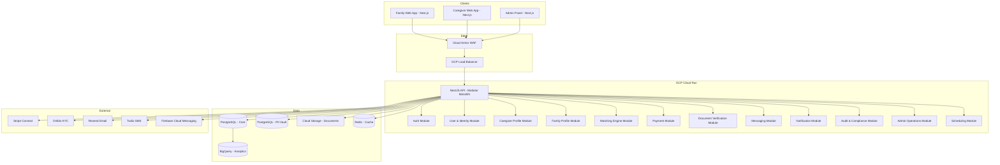
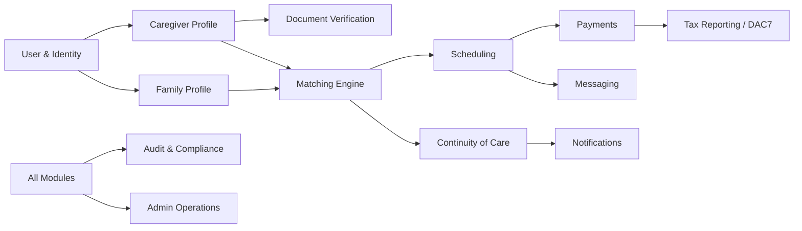

<!-- Source: Caregiver_Platform_IT_Architecture.md | Sections: 1, 2, 3, 4 -->

## 1. Executive Architecture Overview

This document defines the production-ready technical architecture for a digital marketplace that connects professional caregivers with families requiring elderly care services. The platform operates as a managed marketplace — not a passive listing board — actively managing verification, risk, quality, and continuity of care.

The system is designed around a **modular monolith** deployed on **Google Cloud Platform (GCP)**, chosen for its strong EU data residency options, competitive pricing for startups, and mature managed services. The architecture enforces privacy-by-design principles with physically separated sensitive data stores, immutable audit logging, and GDPR-compliant data handling from day one.

Key architectural decisions prioritize operational simplicity for a small engineering team (3–5 developers) while maintaining a clear path to service extraction as the platform scales from Polish metropolitan areas to EU-wide operations across the PL→DE/AT corridor.

### Core Architecture Properties

| Property | Implementation | Rationale |
|----------|---------------|-----------|
| Security First | Centralized identity (Supabase Auth), encrypted PII vault, WAF, RBAC/ABAC | Healthcare-adjacent data requires defense-in-depth |
| Privacy by Design | Separated PII store, time-limited access tokens, automatic data retention policies | GDPR Art. 25 compliance from launch |
| Cost Efficiency | GCP Cloud Run (pay-per-use), managed Postgres, serverless queues | Target <€500/month for MVP infrastructure |
| Operational Simplicity | Modular monolith, single deployment unit, managed services | Small team cannot operate microservices |
| Scalability | Stateless compute, connection pooling, async job processing | Horizontal scaling without re-architecture |
| Compliance Readiness | DAC7 pipeline, audit logs, RODO Art. 9 encryption, PD A1 automation | EU regulatory requirements from first transaction |

---

## 2. Architecture Style Decision

### Evaluation of Approaches

Three architecture styles were evaluated against the constraints of a small engineering team, healthcare-adjacent data sensitivity, and phased EU expansion:

| Approach | Pros | Cons | Verdict |
|----------|------|------|---------|
| Pure Microservices | Independent scaling, tech diversity, fault isolation | High ops overhead, distributed transactions, complex CI/CD, requires platform team | **REJECTED** — premature for team size and stage |
| Simple Monolith | Fast development, single deployment, easy debugging | Domain coupling risk, difficult to extract later, single scaling unit | **REJECTED** — insufficient isolation for sensitive data domains |
| Modular Monolith | Domain isolation, single deployment, clear extraction path, low ops | Requires discipline in module boundaries, shared database | **SELECTED** — optimal balance |

### Selected: Modular Monolith with Isolated Data Stores

The architecture uses a modular monolith as the primary compute unit, deployed as a single NestJS application on GCP Cloud Run. Critical distinction: while the application is a single deployable, it enforces strict module boundaries at the code level with separate database schemas for sensitive data domains.

**Module isolation rules:**

- Each domain module exposes only a typed public API (no direct DB access across modules)
- Sensitive data (PII, documents, health data) resides in logically separated PostgreSQL schemas with distinct access credentials
- Inter-module communication uses in-process event bus (replaceable with message queue for future extraction)
- Payment and document verification modules interact with external services through adapter interfaces

**Extraction triggers (when to split a module into a service):**

- Independent scaling requirement (e.g., matching engine under heavy load)
- Different deployment cadence needed
- Regulatory requirement for physical data isolation
- Team grows beyond 8 engineers

---

## 3. High-Level System Architecture

The platform comprises the following major components, each designed to minimize operational overhead while maintaining strong security boundaries:

| Component | Technology | Deployment | Purpose |
|-----------|-----------|------------|---------|
| Web Platform | Next.js 15 (App Router) | Vercel / GCP Cloud Run | Family-facing search + caregiver portal, SSR for SEO |
| Backend API | NestJS 11 (Node.js 22) | GCP Cloud Run | Core business logic, REST + limited GraphQL |
| Authentication | Supabase Auth | Managed SaaS | JWT-based auth, MFA, social login, phone verification |
| Primary Database | PostgreSQL 16 (Cloud SQL) | GCP Cloud SQL | Core transactional data, JSONB for flexible care needs |
| PII Vault | PostgreSQL 16 (separate instance) | GCP Cloud SQL | Encrypted sensitive personal data, restricted access |
| Document Storage | GCP Cloud Storage (encrypted) | GCP managed | Identity docs, certifications, signed URL access |
| Document Verification | Onfido API | External SaaS | KYC/identity verification, document authenticity |
| Matching Engine | NestJS module + PostgreSQL | In-process (extractable) | Caregiver-family matching with scoring algorithm |
| Payments | Stripe Connect (EU) | External SaaS | Split payments, escrow, IBAN collection, DAC7 data |
| Notifications | GCP Pub/Sub + Firebase FCM | Managed | Push, email (Resend), SMS (Twilio) |
| Admin Panel | Next.js (shared app, admin routes) | Same deployment | Coordinator tools, verification queue, analytics |
| Observability | GCP Cloud Logging + Grafana Cloud | Managed | Structured logs, metrics, tracing, alerting |
| Queue / Async Jobs | GCP Cloud Tasks + Pub/Sub | Managed | Background jobs, event processing, retries |
| Analytics | Metabase + BigQuery | Managed | Business intelligence, outcome measurement, grant reporting |
| Cache | Redis (Memorystore) | GCP managed | Session data, rate limiting, matching cache |
| Search | PostgreSQL full-text (pg_trgm) | In-database | Caregiver discovery, filtering (upgrade to Typesense later) |

---

## 4. System Architecture Diagram

### High-Level System Topology

### Domain Module Interaction

---

